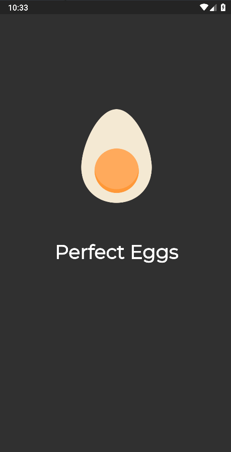

<div align="center" >
  
</div>
<h1 align="center" >
    Perfect Eggs
</h1>

<h4 align="center">
  Hora de cozinhar ovos! Escolha uma opção e aguarde o tempo de cozimento!
</h4>
<div align="center" >
  
</div>

<p align="center">
  <a href="#large_blue_diamond-sobre">Sobre</a>&nbsp;&nbsp;&nbsp;|&nbsp;&nbsp;&nbsp;
  <a href="#large_blue_diamond-conteudo-estudado">Conteúdo estudado</a>&nbsp;&nbsp;&nbsp;|&nbsp;&nbsp;&nbsp;
  <a href="#large_blue_diamond-tecnologias">Tecnologias</a>&nbsp;&nbsp;&nbsp;|&nbsp;&nbsp;&nbsp;
  <a href="#large_blue_diamond-como-utilizar">Como instalar</a>
</p>
<br/>

## :large_blue_diamond: Sobre

Esta aplicação serve como <i>timer</i> para cozimento de ovos. Ao escolher uma das opções, o temporizador é disparado para o início de cozimento. O usuário pode cancelar a operação e iniciar novamente.

É uma boa ideia para aqueles que desejam cozinhar e tem outros afazeres. (Os tempos colocados são fictícios, portanto, não teste com ovos reais :D)

Este projeto foi desenvolvido no curso Fluter Apps: Perfect Eggs, do [Balta.io](https://balta.io/).
<br/>
<br/>

## :large_blue_diamond: Conteudo estudado

Neste projeto de estudo foram vistos os seguintes conteúdos:

- Organização e componentização de widgets
- Organização de assets, utilizando fontes e animações
- Provider (Singleton Pattern)
- Gerenciamento de estados com BLOC
- Muita animação com Flare
- Temas com Material Design
- Navegação de páginas
- Criação de Splash Screen
  <br/>
  <br/>

## :large_blue_diamond: Tecnologias

Este projeto foi desenvolvido com as seguintes tecnologias

- [Flutter](https://flutter.dev/)
- [Flare Flutter](https://pub.dev/packages/flare_flutter)
- [Provider](https://pub.dev/packages/provider)
- [VS Code][vc]
  <br/>
  <br/>

## :large_blue_diamond: Como utilizar

Para rodar a aplicação você precisa ter o [Git](https://git-scm.com) e [Flutter](https://flutter.dev/) na sua máquina. Você precisará também de um emulador para Android ou IOS.
Como sugestão, utilize o emulador Android do [Android Studio](https://developer.android.com/studio) ou o [Genymotion](https://www.genymotion.com/).

Abra seu emulador e siga os comandos abaixo em seu terminal:

```bash
# Clone this repository
$ git clone https://github.com/agnaldoburgojr/fuel-price-app fuelPrice

# Go into the repository
$ cd fuelPrice

# Run the app
$ flutter run
```

<br/>
<br/>

## :large_blue_diamond: Licença

Este projeto possui Licença MIT. Olhe [LICENSE](https://github.com/agnaldoburgojr/perfect-eggs/blob/master/LICENCE) para mais informações.

<br/>
<br/>
---

Feito com ♥ por Agnaldo Burgo Junior :wave: [Get in touch!](https://www.linkedin.com/in/agnaldo-burgo-junior/)

[vc]: https://code.visualstudio.com/
